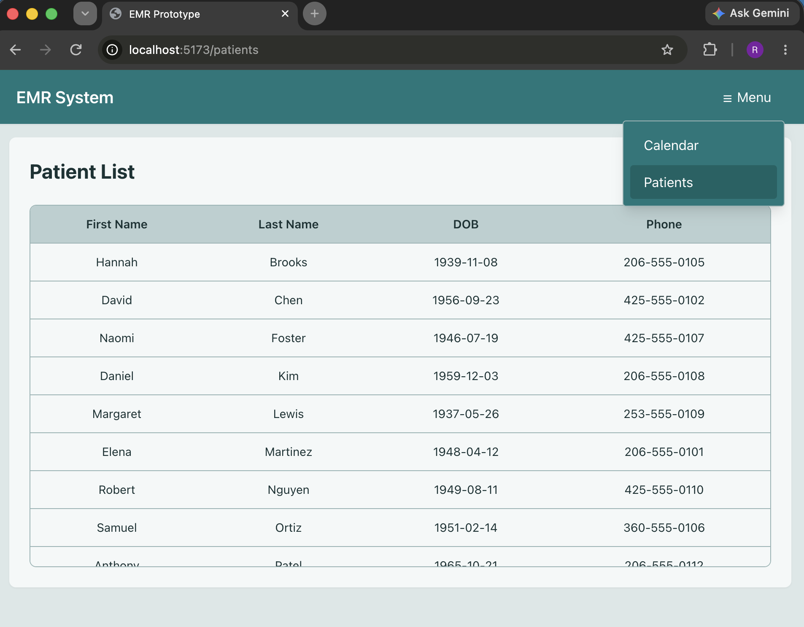
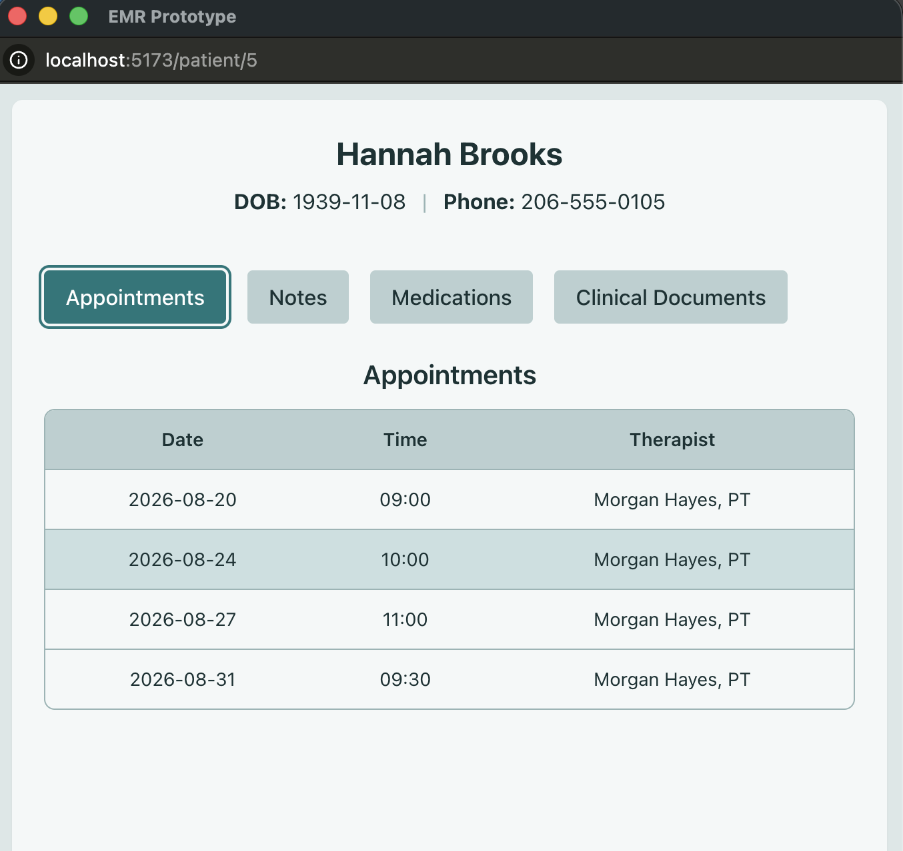
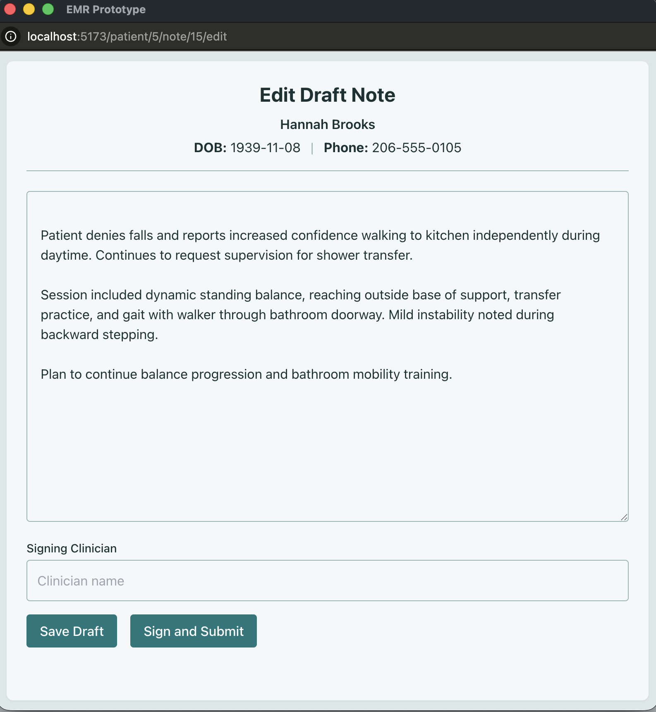
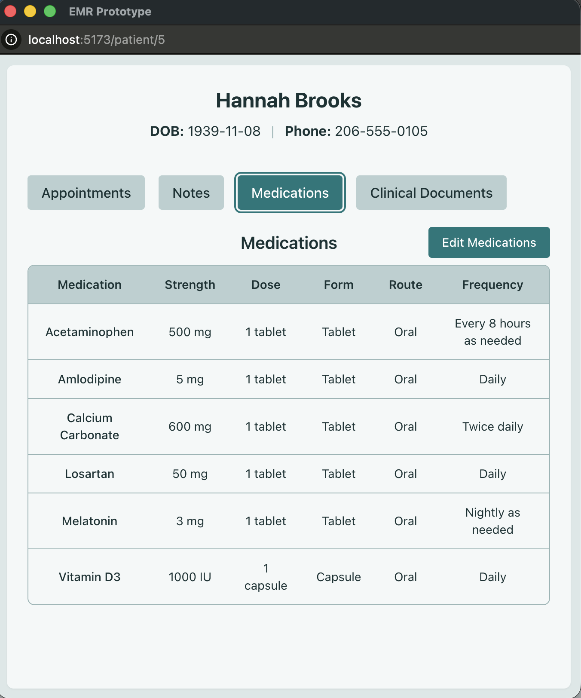
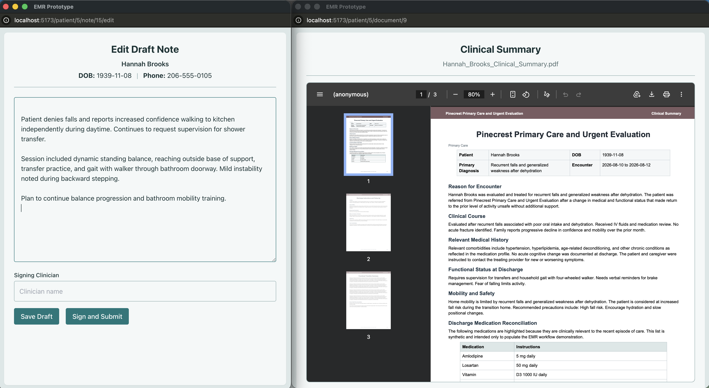
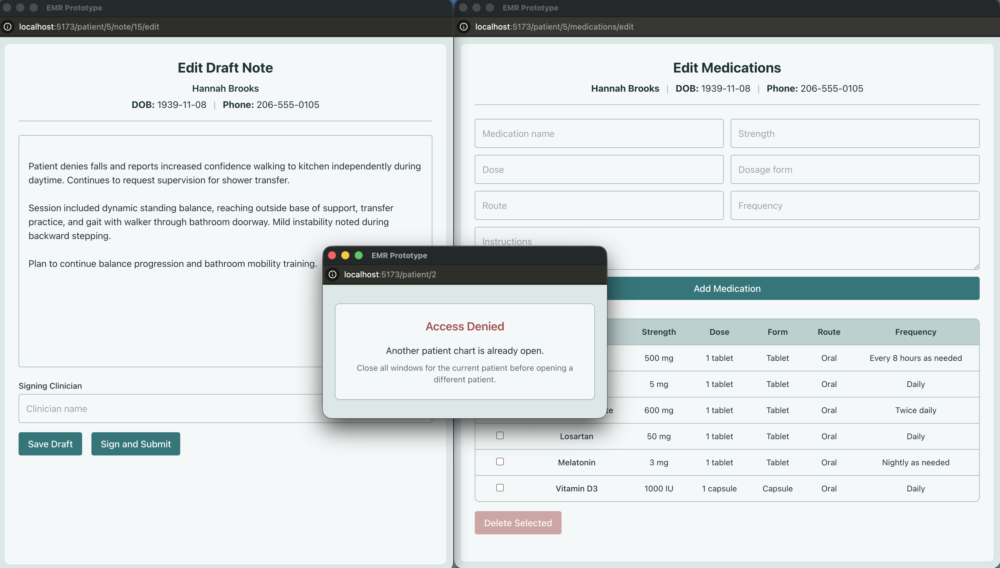

# Electronic Medical Record (EMR) Workflow Prototype

## Overview

This project is a full-stack Electronic Medical Record (EMR) workflow prototype built using React, Node.js, Express, and PostgreSQL.

Rather than attempting to recreate a complete production EMR, the project focuses on a specific clinician workflow and patient-safety problem encountered in home health and outpatient documentation.

Traditional single-window workflows can make it difficult to reference previous documentation, medication lists, and source documents while documenting care. This can encourage inefficient or insecure workarounds. This prototype explores an alternative workflow that allows multiple windows for the same patient while preventing simultaneous access to different patient charts.

---

## Problem

Clinical documentation often requires clinicians to reference multiple sources while actively documenting patient care.

Examples include:

- Reviewing previous notes while writing a new note.
- Performing medication reconciliation while referencing an external medication source document.
- Reviewing appointments or other patient information without leaving the current documentation workflow.
- Moving repeatedly between different areas of the same patient record.

Restricting these tasks to a single active window creates unnecessary context switching. Allowing unrestricted multi-window access, however, introduces the risk of simultaneously working in different patient charts and documenting information in the wrong record.

---

## Solution

The application uses a patient-centered multi-window workflow.

Clinicians can open multiple resources belonging to the same patient in separate windows, allowing reference information to remain visible during documentation.

A patient access guard tracks the active patient context and prevents a different patient's chart from being opened while windows associated with the current patient remain active.

This provides the flexibility of multi-window documentation while preserving a clear patient boundary.

Following clinician workflow review, window placement was standardized around the role of each window. Navigation and reference content opens on the left side of the available workspace, while writing and editing workflows open on the right. This provides a usable default multi-window layout without requiring clinicians to manually resize and reposition windows before beginning documentation.

---

## Features

### Implemented

- Patient directory and dedicated patient workspaces
- Patient-specific retrieval of appointments, notes, medications, and clinical documents
- Multi-window access to resources belonging to the same patient
- Cross-patient access guard preventing simultaneous workflows across different patient charts
- Clinical note creation and draft saving
- Reopening and editing existing draft notes
- Note signing with clinician identification and timestamp
- Backend-enforced locking of signed notes
- Read-only viewing of signed clinical notes
- Medication list viewing and editing
- Clinical source-document viewing
- Patient identification maintained across documentation and reference windows
- Standardized clinical data tables and application-wide UI styling
- React frontend with Express REST API and PostgreSQL backend
- Workflow-based default window positioning with navigation/reference content on the left and writing/editing workflows on the right

### In Progress / Potential Extensions

- Functional appointment calendar
- Cloud storage for uploaded clinical documents
- Authentication and role-based clinician identity

These features are potential extensions rather than requirements for the core workflow prototype.

---

## Technology Stack

### Frontend

- React
- Vite
- Tailwind CSS
- Vitest
- React Testing Library
- jsdom

### Backend

- Node.js
- Express
- Jest
- Supertest

### Database

- PostgreSQL

---

## Database Schema

### patient_info

- patient_id (PK)
- fname
- lname
- dob
- phone

### notes

- note_id (PK)
- patient_id (FK)
- content
- created_at
- signed_therapist
- is_signed
- signed_at

### appointments

- appointment_id (PK)
- patient_id (FK)
- scheduled_date
- scheduled_time
- scheduled_therapist

### medications

- medication_id (PK)
- patient_id (FK)
- medication_name
- strength
- dose
- dosage_form
- route
- frequency
- instructions

### clinical_documents

- document_id (PK)
- patient_id (FK)
- document_type
- document_name
- file_path
- uploaded_at

---

## Note Workflow

Clinical notes follow a simple documentation lifecycle:

```text
Create Note
    │
    ▼
Save Draft
    │
    ▼
Reopen / Edit Draft
    │
    ▼
Sign and Submit
    │
    ▼
Signed + Timestamped
    │
    ▼
Read-Only / Locked
```

Signed-note locking is enforced by the backend rather than relying only on frontend controls.

---

## Multi-Window Patient Safety Workflow

```text
Patient A Workspace
        │
        ├── Previous Note Window
        ├── New / Draft Note Window
        ├── Medication List
        └── Clinical Document
                 │
                 ▼
        Same patient context allowed

Patient B Workspace
        │
        ▼
Blocked while Patient A
workflow remains active
```

This restriction is the central workflow decision explored by the project.

---

## Architecture

```text
React Frontend
        │
        │ HTTP / JSON
        ▼
Express REST API
        │
        ▼
PostgreSQL
```

Patient-specific foreign-key relationships and API queries keep clinical information associated with the appropriate patient record.

---

## Project Scope

The goal of this project is not to build a production-ready EMR or reproduce every feature found in a commercial healthcare platform.

Instead, it demonstrates the implementation of a focused workflow concept: allowing clinicians to use multiple windows when working within one patient record while preventing simultaneous cross-patient workflows.

The prototype combines clinical workflow considerations with full-stack software design, including patient-scoped data retrieval, relational data modeling, stateful documentation workflows, backend-enforced note locking, frontend access controls, and automated testing of core workflow behaviors.

---

## Testing

Automated tests focus on the workflow, data-isolation, and record-integrity behaviors central to the prototype.

### Backend Integration Testing

Backend integration tests use Jest and Supertest against an isolated PostgreSQL test database. Test data is created specifically for each suite and removed after execution, preventing tests from modifying the populated demonstration database.

Backend tests cover:

- Patient-specific note retrieval
- Draft note creation and editing
- Note signing and backend-enforced locking
- Note validation and error handling
- Patient-specific medication retrieval
- Medication creation, validation, and deletion
- Patient-specific clinical-document retrieval
- Clinical-document metadata retrieval
- Patient retrieval and error handling
- Patient-specific appointment retrieval and chronological ordering

Run backend tests from the `server` directory:

```bash
npm test
```

### Frontend Workflow Testing

Frontend tests use Vitest, React Testing Library, and jsdom to validate the patient access guard and workflow-based window positioning.

Tests verify that:

- The first patient establishes the active patient context
- Multiple windows for the same patient are allowed
- A different patient is blocked while another patient remains active
- Closing one same-patient window preserves the active context when other windows remain
- Closing the final window releases the patient restriction
- A different patient can then establish a new active context
- Reference/navigation windows default to the left side of the available screen
- Writing/editing windows default to the right side of the available screen
- Window dimensions adapt to the available screen size
- Popup-blocked behavior is handled without application failure

Run frontend tests from the project root:

```bash
npm test
```

Together, these suites provide automated regression testing for the patient-scoped data access, documentation lifecycle, and cross-patient workflow restrictions central to the prototype.

---

## Clinician Workflow Feedback

The prototype was reviewed with practicing physical therapists using simulated clinical workflows and synthetic patient data.

Two recurring workflow concerns were identified:

- **Window organization:** Although the prototype supported multiple windows, newly opened windows required manual resizing and repositioning. This introduced user effort before the multi-window workflow became useful.
- **Tab organization:** Clinicians identified tabs as a useful way to organize multiple reference resources when more than one reference item needs to remain readily accessible.

### Changes Resulting from Feedback

The window-opening workflow was redesigned around a consistent workspace model:

- **Viewing and navigation → left side**
- **Writing and editing → right side**

Patient navigation, signed notes, medication lists, and clinical source documents therefore default to the left side of the available screen, while note authoring and medication editing default to the right.

This creates a usable two-pane layout immediately when a working window is opened and reduces the manual window management required by the original implementation.

Tab-based organization remains a potential extension for workflows requiring multiple simultaneously accessible reference resources rather than attempting to subdivide the available screen into increasingly small windows.

---

## Screenshots

### Patient Directory

The patient directory provides the entry point into the EMR. Selecting a patient opens a dedicated patient workspace while preserving the application's patient-specific routing and data isolation.




### Patient Workspace

Each patient workspace provides access to appointments, clinical notes, medications, and external clinical documents from a single patient context. Patient identification remains visible throughout the workspace to reduce ambiguity while navigating clinical information.




### Clinical Documentation

Clinicians can create and save draft notes, reopen drafts for continued editing, and formally sign and submit completed documentation. Signed notes are timestamped and locked against further editing, separating incomplete documentation from the finalized clinical record.




### Medication Reconciliation

Patient-specific medication lists display medication name, strength, dose, dosage form, route, frequency, and additional instructions. A separate editing workflow allows medications to be added or removed while keeping the medication list available within the patient workspace.




### Multi-Window Patient Workflow

The application allows clinicians to open multiple resources for the same patient simultaneously, such as documenting a visit while referencing an external hospital discharge summary.



Attempting to open a different patient's chart while another patient remains active is blocked, reducing the risk of documentation occurring in the wrong patient context.



---

## Running Locally

### Frontend

```bash
npm install
npm run dev
```

### Backend

```bash
cd server
npm install
npm start
```

Frontend:

`http://localhost:5173`

Backend:

`http://localhost:3001`

---

## Author

Ryan Dailey

- B.S. Computer Science
- Doctor of Physical Therapy
- Software Engineering & Product Management